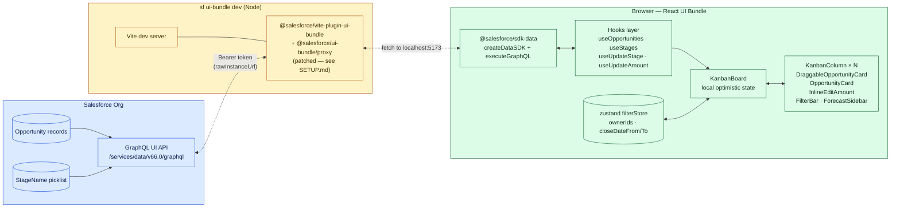

# Pipeline Kanban — React on Salesforce Multi-Framework

A small, MIT-licensed teaching repository that shows what React on
the Salesforce Platform actually buys you compared to Lightning Web
Components — using a single, focused use case: an interactive Sales
Pipeline Kanban board with optimistic drag-and-drop, a weighted
forecast sidebar, and inline edit on Amount.

It is **not** a recipes collection (see [`trailheadapps/multiframework-recipes`](https://github.com/trailheadapps/multiframework-recipes))
and **not** a full sample app (see the Property Management Multi-Framework App).
It sits between: one app, one user story, every relevant Multi-Framework
pattern touched exactly once.

> **Target reader:** A Salesforce developer with 1–2 years of LWC
> experience who has never written a React app on the platform. Reads
> end-to-end in 30 minutes; walks away knowing when and how to reach
> for Multi-Framework.

## Why this exists

See [`docs/TEACHING-NOTES.md`](docs/TEACHING-NOTES.md) for the full
rationale. Short version: drag-and-drop between Kanban columns is the
canonical "this is awkward in LWC" example, and a single feature can
exercise the whole `@salesforce/sdk-data` surface (queries, mutations,
client-side state) without dragging in CPQ or Service-Cloud datamodel
overhead first.

## Beta caveats

- Multi-Framework is in **open beta** (Spring '26). Scratch orgs and
  sandboxes only — production deployment is not supported.
- Org default language must be English.
- The CLI plugin `@salesforce/plugin-ui-bundle-dev` is required for
  the local dev server.
- Three plugin bugs in `@salesforce/ui-bundle@1.132.0` are patched via
  `patch-package`. See [`docs/SETUP.md`](docs/SETUP.md#known-beta-template-issues)
  for the diff and the symptoms each one fixes — none survive once the
  beta exits, but as long as you're on a current beta release expect
  to need them.
- App Launcher integration via UIBundle-pointing tabs and
  CustomApplications is **not** in this repo. The metadata schemas
  haven't stabilised in the beta. The primary run path is the local
  dev server with a GraphQL proxy to your org — see Setup below.

## Setup

See [`docs/SETUP.md`](docs/SETUP.md) for prerequisites, install,
permission set deploy, seed data, and the dev-server flow. TL;DR:

```bash
git clone https://github.com/rammc/sf-react-pipeline-kanban.git
cd sf-react-pipeline-kanban/force-app/main/default/uiBundles/pipelineKanban
npm install
sf config set target-org <your-sandbox-alias>
cd ../../../../..  # back to repo root
sf apex run --file scripts/seed-opportunities.apex
cd force-app/main/default/uiBundles/pipelineKanban
sf ui-bundle dev -n pipelineKanban -b
```

Browser opens; six (or however-many-your-org-has) stage columns of
Opportunities render; drag a card, edit an Amount, watch the forecast
update.

## Architecture

Three layers, one direction of data:



[`docs/ARCHITECTURE.md`](docs/ARCHITECTURE.md) has four more sequence
diagrams (initial load, drag-and-drop with rollback, inline edit,
filter / forecast) plus the load-bearing design decisions — manual
types vs codegen, client-side filtering, where the optimistic update
lives, why zustand for one piece of state.

## Walking through the code

The git log is the table of contents. Read the commits in order;
each one corresponds to one phase of the build, ends in a runnable
state, and only adds what that phase teaches:

| Phase | Commit subject | What's introduced |
|---|---|---|
| 1 | `chore: scaffold Multi-Framework UIBundle …` | Project bootstrap, deps, template, no UI logic |
| 2 | `feat: add Data SDK client, GraphQL queries, and typed hooks` | `createDataSDK`, GraphQL strings, three minimal hooks, six unit tests |
| 3 | `feat: render static Kanban from Salesforce data + verify against live org` | Static board with real data, schema verified against a live sandbox, three plugin bugs found and patched |
| 4 | `feat: drag-and-drop stage updates with optimistic UI` | dnd-kit + `DragOverlay`, optimistic state in `KanbanBoard`, sonner toast on rollback |
| 5 | `feat: filters, weighted forecast, and inline amount edit` | zustand filter store, `ForecastSidebar`, `react-hook-form`-driven inline edit |
| 6 | `docs: README, architecture notes, and teaching guide` | Tests, error boundary, CI, the full doc set |

`git log --oneline` and `git show <hash>` will tell you exactly what
each step touched.

## What's deliberately **not** here

| Excluded | Why |
|---|---|
| Apex triggers, validation rules, custom objects | Out of teaching scope; everything happens through the GraphQL UI API. |
| Authentication code | The SDK + dev-server proxy handle it. |
| TanStack Query / Redux / Apollo Client | Each adds learning surface without showing a Multi-Framework-specific concept. The hooks here are plain `useState` + `useEffect` so the data flow is observable. |
| Lightning App Builder integration | Not supported in beta. |
| i18n / l10n | Beta requires English default language. |
| Mobile-specific layouts | Out of scope for an example. |
| Production CI/CD pipelines | The `.github/workflows/ci.yml` here runs lint + test; no deploy. |
| Agentforce, Marketing Cloud, Service Cloud features | Different teaching repos. |

## Further reading

- [Multi-Framework Beta documentation](https://developer.salesforce.com/docs/platform/multi-framework/) (Salesforce)
- [`trailheadapps/multiframework-recipes`](https://github.com/trailheadapps/multiframework-recipes) — pattern-by-pattern recipes (a step beyond this repo)
- [Property Management Multi-Framework App](https://github.com/trailheadapps) — a full sample app (the next step beyond recipes)

## License & contributing

[MIT](LICENSE). Issues and PRs welcome — there's a deliberately short
`.github/ISSUE_TEMPLATE/` set for bug reports, feature requests, and
plain questions. The repo is small enough that a real review fits in
one pass; please keep PRs scoped that way.
