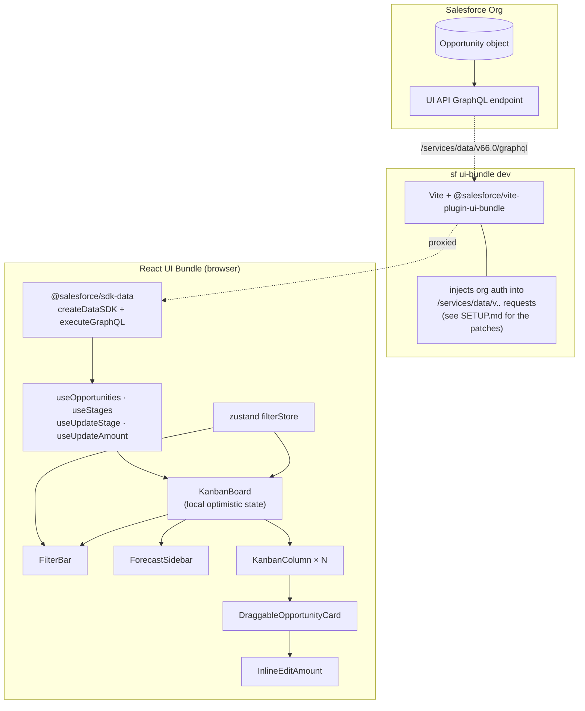

# Architecture

A 30-minute read-through of how the pieces connect, why each layer
exists, and where the trade-offs are.

## Component & data flow

## Layers

### `src/api/`
Single-purpose: GraphQL strings + the thin `executeGraphQL` wrapper
around `createDataSDK`. No knowledge of React or business logic.

### `src/hooks/`
Plain `useState` + `useEffect`. No third-party data layer (TanStack
Query, Apollo, SWR…). Each hook is ~50 lines and does one thing —
load opportunities, load stages, fire one mutation. Tests mock
`@/api/graphqlClient`.

### `src/store/filterStore.ts`
The single shared piece of UI state — selected owners + close-date
range — lives in zustand. Three components read it (`FilterBar`
writes, `KanbanBoard` filters, `ForecastSidebar` aggregates), so
prop-drilling would have crossed three layers. Context would have
worked too, but with more boilerplate per consumer.

### `src/components/kanban/`
Behavior split from display:

| File | Owns |
|---|---|
| `KanbanBoard.tsx` | Hook orchestration, optimistic local state, drag-end + amount-update handlers, layout |
| `KanbanColumn.tsx` | One column; `useDroppable` so cards can be dropped onto it |
| `DraggableOpportunityCard.tsx` | `useDraggable` wrapper — `transform`, `listeners`, `attributes` |
| `OpportunityCard.tsx` | Pure visual card (Name / Amount / Date / Owner). Reused in `DragOverlay` without dnd-kit knowledge. |
| `InlineEditAmount.tsx` | `react-hook-form` for one numeric field; resolves or rejects so the parent can roll back |
| `FilterBar.tsx` | Owner chips + date inputs; reads/writes the zustand store |
| `ForecastSidebar.tsx` | Pure derivation over the filtered list — no own state, no own queries |
| `BoardSkeleton.tsx`, `EmptyState.tsx` | Loading + empty placeholders |

## Decisions

### Filter is client-side
`OPPORTUNITIES_QUERY` caps at `first: 200`, the dataset is bounded.
A round-trip per filter change adds latency and doubles the GraphQL
surface for no teaching benefit. If a real customer needed
server-side filtering, the right move is to push it into the query
via `where:` clauses on the GraphQL connection.

### Types are hand-written, not codegen
The template ships codegen wiring (`graphql-codegen` + a schema
fetcher), but it requires an authenticated org at build time. For a
tutorial repo that should clone-and-run, hand-typed shapes in
`src/types/opportunity.ts` are clearer and remove the org gate.
`docs/SETUP.md#codegen-requires-a-connected-org` describes how to
enable codegen if you want to.

### Optimistic update lives in `KanbanBoard`
A local `Opportunity[]` state mirrors `useOpportunities` via
`useEffect`. Mutations (drag-drop, inline-edit) snapshot, update
locally, fire the SDK call, and roll back on rejection — surfacing
errors via sonner toast.

This is the **why React** moment of the repo: the user sees
immediate UI changes without spinners, the network reconciles
afterwards, and the rollback is six lines of code. The same
behavior in LWC needs `@track`-shaped mutable state, manual revert
plumbing, and no built-in DnD primitive.

### Two near-identical mutation hooks (`useUpdateStage` + `useUpdateAmount`)
Deliberate duplication. They have the same five-line shape; merging
into a single `useUpdateOpportunity(partial)` would hide the pattern
behind one parameter. For a tutorial it's clearer to show the
parallel structure twice. A future refactor commit can collapse them
once a reader has internalised the shape.

### shadcn/ui kept (despite "no design system" in the original brief)
shadcn copies components into your repo and wraps Radix primitives —
no vendor lock-in, accessibility baseline included. Different from
SLDS-React or MUI. The discipline rule: only use the shadcn pieces
you actually need (Card, Avatar, Skeleton, Button, Input, sonner).
We do **not** add components ahead of demand.

### react-router kept, single route
The template ships `react-router` as part of its shell. Stripping it
would have cost more than it saved. A single `/` route renders
KanbanBoard. Adding `/opportunity/:id` is a stretch goal —
see `docs/TEACHING-NOTES.md`.

## What this repo intentionally does not show

- A second route. Adding one is the recommended exercise.
- A custom Apex callout. Everything is GraphQL.
- A real test pyramid. There are 9 tests — three for each hook plus
  one suite for the board. They're examples of where to put tests,
  not a coverage target.
- Server-side filtering, pagination, infinite scroll. Bounded dataset.
- Real-time updates / Streaming API. Optimistic UI is the substitute.
- A design system. Spacing and colour come straight from Tailwind +
  shadcn defaults.
